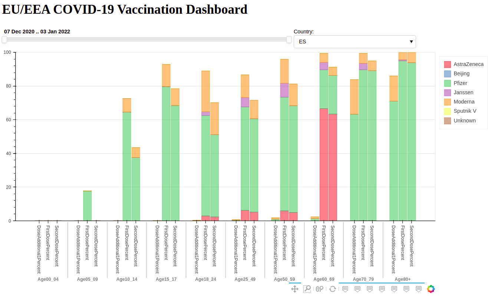

# covid19_dashboard
COVID-19 Dashboard Demo built on Bokeh is available [here](https://covid19-vaccination-dashboard.herokuapp.com/covid19dashboard).

# Setup

To run the dashboar locally.

1. Install Python requirements:

```Bash
pip install -r requirements.txt
```

2. Run the server
 
```Bash
bokeh serve covid19dashboard
```
3. Access to http://localhost:5006/covid19dashboard


